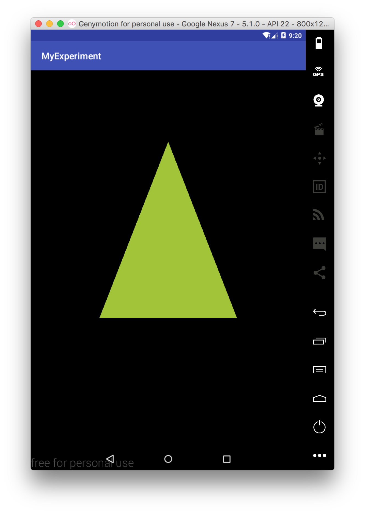
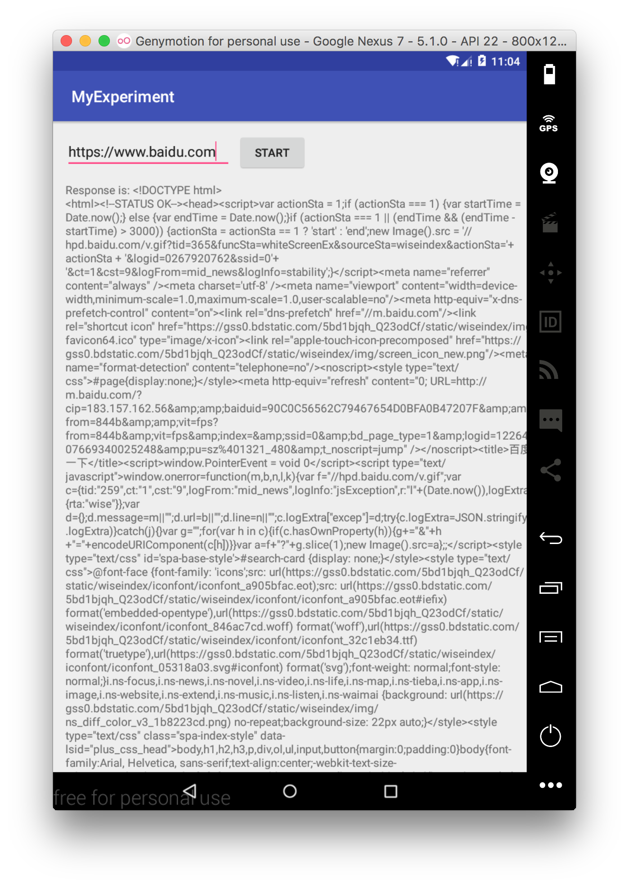
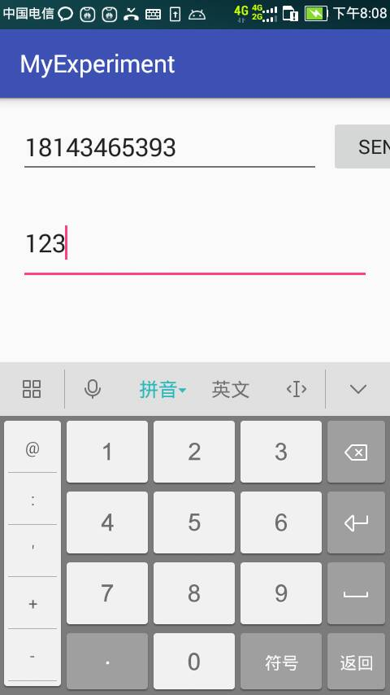
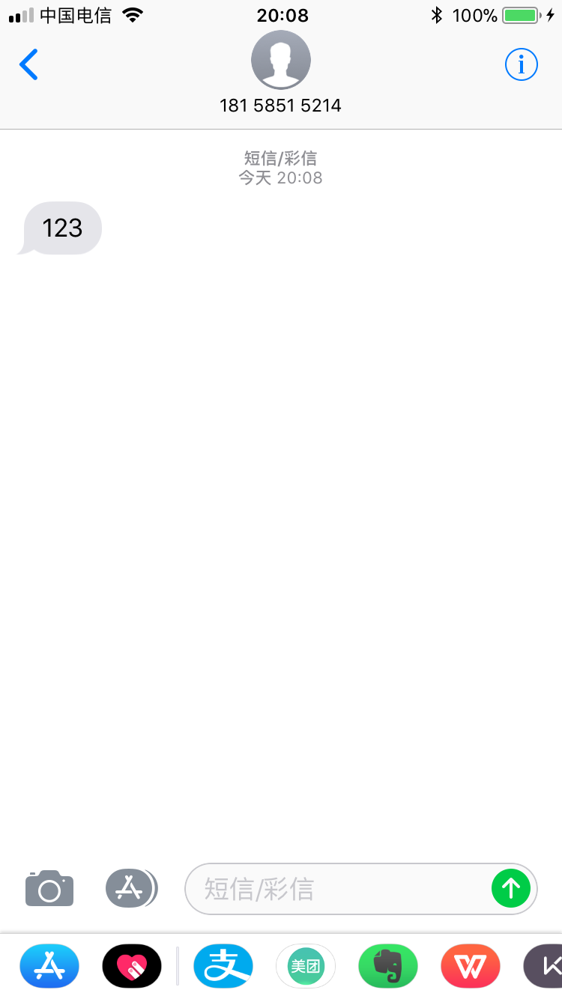
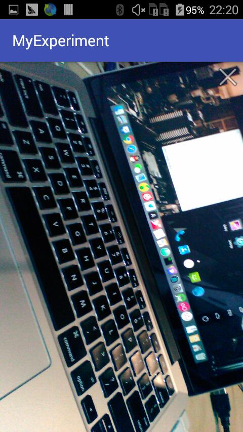

# 智能终端软件开发基础实验报告

3150104785 郝广博

## 系统安装与HelloWorld

1. Java环境我的电脑上之前已经有了，所以不需要再配置了。

2. 通过官网下载并安装Android Studio。

   

3. 通过Android Studio创建一个新项目

   

   ​

4. 新建项目完成

   

5. 在模拟器中运行这个Android App

   

## 界面设计：控件与布局

通过`activity_main.xml`来设计布局：


模拟器中查看效果：


## 图形绘制与OpenGL

创建`Triangle.java`和`Square.java`，实现图形的定义（`Square`的定义省略）：

```java
package com.example.hao.myexperiment;

import android.opengl.GLES20;

import java.nio.ByteBuffer;
import java.nio.ByteOrder;
import java.nio.FloatBuffer;

public class Triangle {

    private int mPositionHandle;
    private int mColorHandle;

    private final int vertexCount = triangleCoords.length / COORDS_PER_VERTEX;
    private final int vertexStride = COORDS_PER_VERTEX * 4; // 4 bytes per vertex

    public void draw() {
        // Add program to OpenGL ES environment
        GLES20.glUseProgram(mProgram);

        // get handle to vertex shader's vPosition member
        mPositionHandle = GLES20.glGetAttribLocation(mProgram, "vPosition");

        // Enable a handle to the triangle vertices
        GLES20.glEnableVertexAttribArray(mPositionHandle);

        // Prepare the triangle coordinate data
        GLES20.glVertexAttribPointer(mPositionHandle, COORDS_PER_VERTEX,
                GLES20.GL_FLOAT, false,
                vertexStride, vertexBuffer);

        // get handle to fragment shader's vColor member
        mColorHandle = GLES20.glGetUniformLocation(mProgram, "vColor");

        // Set color for drawing the triangle
        GLES20.glUniform4fv(mColorHandle, 1, color, 0);

        // Draw the triangle
        GLES20.glDrawArrays(GLES20.GL_TRIANGLES, 0, vertexCount);

        // Disable vertex array
        GLES20.glDisableVertexAttribArray(mPositionHandle);
    }

    private FloatBuffer vertexBuffer;
    private final int mProgram;

    // number of coordinates per vertex in this array
    static final int COORDS_PER_VERTEX = 3;
    static float triangleCoords[] = {   // in counterclockwise order:
            0.0f,  0.622008459f, 0.0f, // top
            -0.5f, -0.311004243f, 0.0f, // bottom left
            0.5f, -0.311004243f, 0.0f  // bottom right
    };

    // Set color with red, green, blue and alpha (opacity) values
    float color[] = { 0.63671875f, 0.76953125f, 0.22265625f, 1.0f };

    public Triangle() {
        // initialize vertex byte buffer for shape coordinates
        ByteBuffer bb = ByteBuffer.allocateDirect(
                // (number of coordinate values * 4 bytes per float)
                triangleCoords.length * 4);
        // use the device hardware's native byte order
        bb.order(ByteOrder.nativeOrder());

        // create a floating point buffer from the ByteBuffer
        vertexBuffer = bb.asFloatBuffer();
        // add the coordinates to the FloatBuffer
        vertexBuffer.put(triangleCoords);
        // set the buffer to read the first coordinate
        vertexBuffer.position(0);

        int vertexShader = MyGLRenderer.loadShader(GLES20.GL_VERTEX_SHADER,
                vertexShaderCode);
        int fragmentShader = MyGLRenderer.loadShader(GLES20.GL_FRAGMENT_SHADER,
                fragmentShaderCode);

        // create empty OpenGL ES Program
        mProgram = GLES20.glCreateProgram();

        // add the vertex shader to program
        GLES20.glAttachShader(mProgram, vertexShader);

        // add the fragment shader to program
        GLES20.glAttachShader(mProgram, fragmentShader);

        // creates OpenGL ES program executables
        GLES20.glLinkProgram(mProgram);
    }

    private final String vertexShaderCode =
            "attribute vec4 vPosition;" +
                    "void main() {" +
                    "  gl_Position = vPosition;" +
                    "}";

    private final String fragmentShaderCode =
            "precision mediump float;" +
                    "uniform vec4 vColor;" +
                    "void main() {" +
                    "  gl_FragColor = vColor;" +
                    "}";

}
```

创建一个`renderer`：

```java
package com.example.hao.myexperiment;

import android.opengl.GLES20;
import android.opengl.GLSurfaceView;

import javax.microedition.khronos.egl.EGLConfig;
import javax.microedition.khronos.opengles.GL10;

public class MyGLRenderer implements GLSurfaceView.Renderer {

    private Triangle mTriangle;
    private Square   mSquare;

    public void onSurfaceCreated(GL10 unused, EGLConfig config) {
        // Set the background frame color
        GLES20.glClearColor(0.0f, 0.0f, 0.0f, 1.0f);
        // initialize a triangle
        mTriangle = new Triangle();
        // initialize a square
        mSquare = new Square();
    }

    public void onDrawFrame(GL10 unused) {
        // Redraw background color
        GLES20.glClear(GLES20.GL_COLOR_BUFFER_BIT);
        mTriangle.draw();
    }

    public void onSurfaceChanged(GL10 unused, int width, int height) {
        GLES20.glViewport(0, 0, width, height);
    }

    public static int loadShader(int type, String shaderCode){

        // create a vertex shader type (GLES20.GL_VERTEX_SHADER)
        // or a fragment shader type (GLES20.GL_FRAGMENT_SHADER)
        int shader = GLES20.glCreateShader(type);

        // add the source code to the shader and compile it
        GLES20.glShaderSource(shader, shaderCode);
        GLES20.glCompileShader(shader);

        return shader;
    }
}
```

在import`EGLConfig`时，一开始写成了`import android.opengl.EGLConfig;`，发现一直在报错，后来发现是因为`onSurfaceCreated`方法的`EGLConfig`参数是想要另外一个包里的`EGLConfig`，改成`import javax.microedition.khronos.egl.EGLConfig;`就可以了。

在`MainActivity.java`中定义`MyGLSurfaceView`并调用：

```java
class MyGLSurfaceView extends GLSurfaceView {

    private final MyGLRenderer mRenderer;

    public MyGLSurfaceView(Context context){
        super(context);

        // Create an OpenGL ES 2.0 context
        setEGLContextClientVersion(2);

        mRenderer = new MyGLRenderer();

        // Set the Renderer for drawing on the GLSurfaceView
        setRenderer(mRenderer);
    }
}

public class MainActivity extends AppCompatActivity {

    private GLSurfaceView myGLView;

    @Override
    protected void onCreate(Bundle savedInstanceState) {
        super.onCreate(savedInstanceState);
        myGLView = new MyGLSurfaceView(this);
        setContentView(myGLView);
//        setContentView(R.layout.activity_main);
    }

}
```

运行效果：



## 网络访问与服务

通过`volley`库来实现http请求，并把结果显示在textView中。

```java
public void onStartClicked(View v){
    final EditText mEditText = (EditText) findViewById(R.id.editText);
    final TextView mTextView = (TextView) findViewById(R.id.textView);
    // Instantiate the RequestQueue.
    RequestQueue queue = Volley.newRequestQueue(this);
    String url =mEditText.getText().toString();

    // Request a string response from the provided URL.
    StringRequest stringRequest = new StringRequest(Request.Method.GET, url,
            new Response.Listener<String>() {
                @Override
                public void onResponse(String response) {
                    // Display the first 500 characters of the response string.
                    mTextView.setText("Response is: "+ response.substring(0,5000));
                }
            }, new Response.ErrorListener() {
        @Override
        public void onErrorResponse(VolleyError error) {
            mTextView.setText("That didn't work!");
        }
    });
    // Add the request to the RequestQueue.
    queue.add(stringRequest);
}
```

值得注意的是，需要在`AndroidManifest.xml`中加入：

```xml
<uses-permission android:name="android.permission.INTERNET" />
```

来获取访问网络的权限。

运行效果：



## 硬件访问与传感器

### 短信发送

通过Android提供的`SmsManager`，可以非常方便的实现发送短信。

```java
private void sendSMS(String address, String content) {
    SmsManager manager = SmsManager.getDefault();
    Intent i = new Intent(SMS_ACTION); //生成PendingIntent，当消息发送完成，接收到广播
    PendingIntent sentIntent = PendingIntent.getBroadcast(this, 0, i, PendingIntent.FLAG_ONE_SHOT);
    manager.sendTextMessage( address, null, content, sentIntent, null);
}
```





### 调用摄像头

首先，基于`SurfaceView`自己实现一个`CameraView`：

```java

public class CameraView extends SurfaceView implements SurfaceHolder.Callback {
    private SurfaceHolder mHolder;
    private Camera mCamera;

    public CameraView(Context context, Camera camera){
        super(context);

        mCamera = camera;
        mCamera.setDisplayOrientation(90);
        //get the holder and set this class as the callback, so we can get camera data here
        mHolder = getHolder();
        mHolder.addCallback(this);
        mHolder.setType(SurfaceHolder.SURFACE_TYPE_NORMAL);
    }

    @Override
    public void surfaceCreated(SurfaceHolder surfaceHolder) {
        try{
            //when the surface is created, we can set the camera to draw images in this surfaceholder
            mCamera.setPreviewDisplay(surfaceHolder);
            mCamera.startPreview();
        } catch (IOException e) {
            Log.d("ERROR", "Camera error on surfaceCreated " + e.getMessage());
        }
    }

    @Override
    public void surfaceChanged(SurfaceHolder surfaceHolder, int i, int i2, int i3) {
        //before changing the application orientation, you need to stop the preview, rotate and then start it again
        if(mHolder.getSurface() == null)//check if the surface is ready to receive camera data
            return;

        try{
            mCamera.stopPreview();
        } catch (Exception e){
            //this will happen when you are trying the camera if it's not running
        }

        //now, recreate the camera preview
        try{
            mCamera.setPreviewDisplay(mHolder);
            mCamera.startPreview();
        } catch (IOException e) {
            Log.d("ERROR", "Camera error on surfaceChanged " + e.getMessage());
        }
    }

    @Override
    public void surfaceDestroyed(SurfaceHolder surfaceHolder) {
        //our app has only one screen, so we'll destroy the camera in the surface
        //if you are unsing with more screens, please move this code your activity
        mCamera.stopPreview();
        mCamera.release();
    }
}
```

然后再`MainActivity`中进行使用：

```java
public class MainActivity extends AppCompatActivity {
    private Camera mCamera = null;
    private CameraView mCameraView = null;

    @Override
    protected void onCreate(Bundle savedInstanceState) {
        super.onCreate(savedInstanceState);
        setContentView(R.layout.activity_main);

        try{
            mCamera = Camera.open();//you can use open(int) to use different cameras
        } catch (Exception e){
            Log.d("ERROR", "Failed to get camera: " + e.getMessage());
        }

        if(mCamera != null) {
            mCameraView = new CameraView(this, mCamera);//create a SurfaceView to show camera data
            FrameLayout camera_view = (FrameLayout)findViewById(R.id.camera_view);
            camera_view.addView(mCameraView);//add the SurfaceView to the layout
        }

        //btn to close the application
        ImageButton imgClose = (ImageButton)findViewById(R.id.imgClose);
        imgClose.setOnClickListener(new View.OnClickListener() {
            @Override
            public void onClick(View view) {
                System.exit(0);
            }
        });
//        setContentView(mPreview);
    }

}
```

运行结果：



## 实验源代码

源代码已托管到GitHub：[链接](https://github.com/awmleer/smartDeviceCourseExperiment)

因为每次实验的内容都不一样，所以可以通过历史commit来查看到每次实验对应的代码。